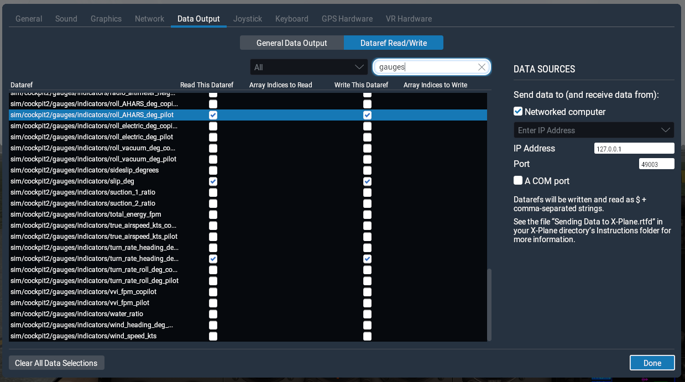

# X-Plane UDP Comms Proof of Concept

This is a very basic project to experiment with communication with X-Plane using the built-in UDP capability. The data this app listens for will eventually drive a graphical interface to mimic the 6 pack and RPM gauge for use with a home flight simulator setup on a separate monitor. Hopefully I'll be able to make the VOR gauges as well. This is to free up real estate on the main screen running the simulator.

## Setup with X-Plane

In X-Plane, go to settings. Click on the "Data Output" tab and click "Dataref Read/Write." Search for the following Dataref objects and click the checkbox under "Read This Dataref."

- sim/cockpit2/gauges/indicators/altitude_ft_pilot
- sim/cockpit2/gauges/indicators/airspeed_kts_pilot
- sim/cockpit2/gauges/indicators/heading_vacuum_deg_mag_pilot
- sim/flightmodel/position/vh_ind_fpm
- sim/cockpit2/engine/indicators/engine_speed_rpm[0]
- sim/cockpit2/gauges/indicators/slip_deg
- sim/cockpit2/gauges/indicators/turn_rate_heading_deg_pilot
- sim/cockpit/misc/ah_adjust
- sim/cockpit2/gauges/indicators/pitch_AHARS_deg_pilot
- sim/cockpit2/gauges/indicators/roll_AHARS_deg_pilot

Under "DATA SOURCES" select "Networked computer." For IP address, type "127.0.0.1." The default port is 49000 but this did not work for me because X-Plane reserves the port to broadcast the data. I use 49003 for this app.

PORT and HOST in ./udpListener.js need to be changed to the IP address and port that you choose.

Thats it. Nothing too fancy, but here it is in case you want to build a setup of your own and want to save yourself the trouble of finding the appropriate dataref keys. As well as parsing the UDP messages.

